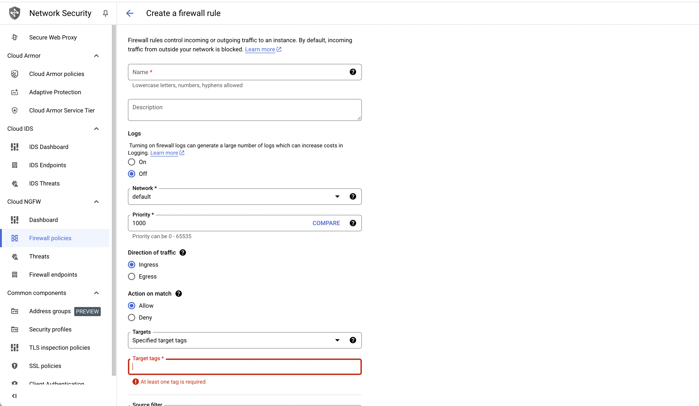

# AizelInference

## Build on Local 
### Install Dependencies
Ubuntu:
```
sudo apt update && sudo apt upgrade -y
sudo apt install -y protobuf-compiler libprotobuf-dev
```
MacOs
```
brew install protobuf
```
## Build 
```
cargo build
```

## Build Docker Image
Make sure that you have already installed the docker in the machine and the user has been added to docker group.

1. Prepare a Google cloud project. Log in to [google cloud console](https://console.cloud.google.com/) through browser. Remember your project number and project ID.


Set the variables in your environment.
```
project_number=
project_id=
```

2. Two service account are required. The first is google's compute engine default service account the format is `$project_number-compute@developer.gserviceaccount.com`. The Second is your account service account which is used to initialize gcloud cli. Please grant the service accounts with these permissions in the picture.


3. Connect to a linux machine and initialize gcloud command line tool. You can follow the [doc](https://cloud.google.com/sdk/docs/install?hl=zh-cn) to install gcloud cli. After installation, run the command `gcloud init` and finish the initialization process. 

4. Clone the repository.
```
git clone -b dev git@github.com:AizelNetwork/AizelInference.git
cd AizelInference
git submodule init 
git submodule update
```
5. Build the submodule.
```
cd aizel-face-recognition
docker build -t aizel-face-recognition-build:0.0.1 -f Dockerfile.build .
docker run --rm --name aizel_face_recognition_build -v ./:/root/aizel-face-recognition aizel-face-recognition-build:0.0.1 sh -c "cd /root/aizel-face-recognition && /usr/local/maven/bin/mvn clean install -D maven.test.skip=true"
```
Then, the `target` directory contains the building result.

6. Create a docker artifact registry in your project. You can replace it with the repository name and region of your choice.

```
repo_name=aizel
region=asia
gcloud artifacts repositories create $repo_name \
    --repository-format=docker \
    --location=$region \
    --description="Aizel Inference Image"
```

7. Build the Aizel inference image. It requires a few minitues. 
```
sudo docker build --tag $region-docker.pkg.dev/$project_number/aizel/aizel_inference:0.1.0 .
```
```
gcloud auth print-access-token | docker login -u oauth2accesstoken --password-stdin https://$region-docker.pkg.dev

docker push $region-docker.pkg.dev/$project_number/aizel/aizel_inference:0.1.0
```
8. Push the imgae to the artifact repository.

## Deploy to Google Confidential Space
1. Create GCP secrets in google secret manager.
```shell
gcloud secrets create aizel-config --replication-policy="automatic"
```

2. Modify the content in the `aizel_config.yml` and upload the config file to gcp secret manager.

A desciption of the aizel config file. 
```
---
chain_id: # The chain id of the smart contract 
endpoint: # The rpc server address (e.g., geth)
inference_contract: # inference contract address 
inference_registry_contract: # inference node registry contract address 
data_registry_contract: # data node registry contract address 
minio_account:  # minio account provided by data node 
minio_password: # minio password provided by data node
node_name:  # name of the inference node 
node_bio:   # simple description of the inference node
data_node_id:  # data node id in the contract
initial_stake:  # initiatl stake amount when register to the contact, unit Wei
wallet_sk:  # secret of your wallet which is used to submit transaction
within_tee: # run the inference inside tee
```

```shell
aizel_config=$(base64 aizel_config.yml)
echo -n $aizel_config | gcloud secrets versions add aizel-config --data-file=-
```

3. Create a network VPC firewall rule to expose 8080 port and add a target tag to the rule. 
Set the tag `tag=`



4. Create confidential space to run the inference node.

```shell
gcloud compute instances create inference-demo \
    --confidential-compute \
    --shielded-secure-boot \
    --scopes=cloud-platform \
    --zone=asia-southeast1-b \
    --image-project=confidential-space-images \
    --image-family=confidential-space-debug \
    --service-account=$project_number-compute@developer.gserviceaccount.com \
    --metadata="^~^tee-image-reference=$region-docker.pkg.dev/$project_id/aizel/aizel_inference:0.1.0~tee-container-log-redirect=true" \
    --machine-type=n2d-standard-16 \
    --min-cpu-platform="AMD Milan" \
    --boot-disk-size=50 \
    --tags=$tag
```

## Deploy to AliCloud TDX Encrypted VM
1. Configure your alicloud cli

1. Prepare resources
- Create a bucket to store the image
    - `aliyun oss mb oss://aizel-tdx -c cn-beijing -L oss-cn-beijing` 
- Upload secrets and configs to oss
    - modify the content in the `aizel_config.yml` 
    - upload the configuration file to the oss `aliyun oss cp aizel_config.yml oss://aizel-tdx/aizel_config.yml`
- Create a RAM role for alicloud deployment
    - `aliyun ram CreateRole --RoleName aizel-inference --Description "Role for Aizel Inference Node" --AssumeRolePolicyDocument "{\"Statement\": [{\"Action\": \"sts:AssumeRole\",\"Effect\": \"Allow\",\"Principal\": {\"Service\": [\"ecs.aliyuncs.com\"]}}],\"Version\": \"1\"}"`
    - `aliyun ram AttachPolicyToRole --PolicyName AliyunOSSReadOnlyAccess --PolicyType System --RoleName aizel-inference`
- Create a keypair for ecs. This keypair is only used to create the ecs instance and it can't be used to ssh login. Sshd service is banned on the Aizel inference.
    - aliyun ecs CreateKeyPair --KeyPairName mock-key
- Prepare your environment variable for your project
    - export VSwitchID=[your switch id]
    - export SecurityGroupId=[your security id]


## Verify TEE attestation report

### GCP verification
```
cd verifier && cargo test --package verifier --lib -- tests::verify_gcp_token --exact --show-output
```

### AliCloud Verification
1. Install dependencies
- On Ubuntu22.04
```
echo "ca_directory=/etc/ssl/certs" >> /etc/wgetrc && \
echo 'deb [arch=amd64] https://download.01.org/intel-sgx/sgx_repo/ubuntu jammy main' | tee /etc/apt/sources.list.d/intel-sgx.list && \
wget -qO - https://download.01.org/intel-sgx/sgx_repo/ubuntu/intel-sgx-deb.key --no-check-certificate | apt-key add -
apt-get update && apt-get install libsgx-dcap-quote-verify-dev libsgx-dcap-default-qpl
```
- On Ubuntu20.04
```
echo "ca_directory=/etc/ssl/certs" >> /etc/wgetrc && \
echo 'deb [arch=amd64] https://download.01.org/intel-sgx/sgx_repo/ubuntu focal main' | tee /etc/apt/sources.list.d/intel-sgx.list &&\
wget -qO - https://download.01.org/intel-sgx/sgx_repo/ubuntu/intel-sgx-deb.key --no-check-certificate | apt-key add -
apt-get update && apt-get install libsgx-dcap-quote-verify-dev libsgx-dcap-default-qpl
```

2. Run the test case
    - change the pccs_url in `/etc/sgx_default_qcnl.conf`, `"pccs_url": "https://sgx-dcap-server.cn-beijing.aliyuncs.com/sgx/certification/v4/"`

## Github Action
1. Create a workload identity pool and provider.
```
gcloud iam workload-identity-pools create github-action \
  --project="${PROJECT_ID}" \
  --location="global" \
  --display-name="GitHub Actions Pool"

gcloud iam workload-identity-pools providers create-oidc github-actions-oidc \
  --project="${PROJECT_ID}" \
  --location="global" \
  --workload-identity-pool=github-action \
  --display-name="GitHub Repository Provider" \
  --attribute-mapping="google.subject=assertion.sub,attribute.actor=assertion.actor,attribute.repository=assertion.repository,attribute.repository_owner=assertion.repository_owner" \
  --attribute-condition="assertion.repository_owner == '${GITHUB_ORG}'" \
  --issuer-uri="https://token.actions.githubusercontent.com"
```

2. Grant the provider with artifact registry writer role.
```
gcloud artifacts repositories add-iam-policy-binding aizel \
  --project="${PROJECT_ID}" \
  --role="roles/artifactregistry.writer" \
  --location=asial \
  --member="principalSet://iam.googleapis.com/projects/991449629434/locations/global/workloadIdentityPools/github-action/attribute.repository/AizelNetwork/AizelInference"

```